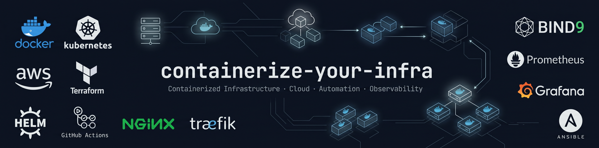

# containerize-your-infra — Containerized Infrastructure Lab

[](https://github.com/Bios-Mod/containerize-your-infra/actions/workflows/web-server.yml)
[](https://github.com/Bios-Mod/containerize-your-infra/actions/workflows/file-transfer.yml)
[](https://github.com/Bios-Mod/containerize-your-infra/actions/workflows/dns.yml)
[](https://github.com/Bios-Mod/containerize-your-infra/actions/workflows/reverse-proxy.yml)
[](https://github.com/Bios-Mod/containerize-your-infra/actions/workflows/full-infra.yml)
[](https://github.com/Bios-Mod/containerize-your-infra/actions/workflows/pull-request.yml)

[](modules/web-server/README.md)
[](modules/dns/README.md)
[](modules/file-transfer/README.md)
[](modules/reverse-proxy/README.md)
[](environments/docker/dev/setup.md)
[](environments/README.md)
[](environments/docker/prod/setup.md)
[](environments/docker/prod/setup.md)
[](stacks/full-infra/README.md)
[](environments/kubernetes/dev/setup.md)
[](stacks/full-infra/kubernetes/full-infra-kubernetes.md)
[](LICENSE)

A practical, step-by-step reference for deploying infrastructure services with
Docker and Kubernetes on Amazon EKS.

Docker and Kubernetes are two complete implementations of the same stack.
Docker covers local development with OrbStack and production on Docker Engine
over EC2. Kubernetes covers a single Amazon EKS cluster with logical dev and
prod environments, packaged with Helm.

Each module covers a real infrastructure service — DNS, file transfer, web
server, and reverse proxy — with the reasoning behind every decision explained
inline.

Built and tested on Ubuntu 24.04 LTS and macOS on Apple Silicon. Docker Engine
runs on Linux hosts, including EC2 t4g.micro, while OrbStack provides the local
macOS development runtime. Kubernetes runs on arm64 Managed Node Groups on
Amazon EKS. All configurations are architecture-agnostic unless noted.

This lab deploys the same services as
[build-your-infra](https://github.com/Bios-Mod/build-your-infra): the same stack
containerized and automated. The two repositories are independent references
that cover the same infrastructure at different levels of abstraction:
self-managed infrastructure and containers.

---

## Runtime Implementations

| Runtime | Environments | Deployment model |
|---|---|---|
| Docker | Local development and EC2 production | Docker Compose |
| Kubernetes | Logical dev and prod environments in one EKS cluster | Helm |

Docker and Kubernetes are complementary implementations of the same
infrastructure stack. Kubernetes does not replace the Docker implementation.

---

## Deploying This Lab

**Docker**

1. Choose your Docker environment and follow its setup guide
2. Apply modules in order — each module is independent and self-contained
3. Deploy the full Docker stack once all modules are verified
4. Provision the Docker production host on EC2 with Terraform —
   [`stacks/full-infra/docker/automation.md`](stacks/full-infra/docker/automation.md)

**Kubernetes**

1. Provision the EKS platform with Terraform —
   [`stacks/full-infra/kubernetes/automation.md`](stacks/full-infra/kubernetes/automation.md)
2. Follow the Kubernetes environment setup guides
3. Deploy each module chart in order: web-server, reverse-proxy, dns
4. Deploy the full stack with the umbrella chart —
   [`stacks/full-infra/kubernetes/full-infra-kubernetes.md`](stacks/full-infra/kubernetes/full-infra-kubernetes.md)

> **Standalone module deployment:** each Docker module includes a
> `docker-compose.prod.yml` for isolated production deployment, and each
> Kubernetes module its own Helm chart, from its own runtime directory.
>
> **Full-stack deployment:** all modules are deployed as a single unit,
> orchestrated from [`stacks/full-infra/`](stacks/full-infra/README.md) with
> Docker Compose or with the Helm umbrella chart.
>
> **Automated deployment:** Terraform provisions the Docker host and launches
> the Docker full stack automatically — no manual steps on the host. On
> Kubernetes, Terraform provisions the EKS platform and the container
> registries; the services are deployed following the full-infra document.

---

## Environments

| Component | Docker dev | Docker prod |
|---|---|---|
| Host | macOS (Apple Silicon) | Ubuntu 24.04 LTS — EC2 t4g.micro / local VM |
| Runtime | OrbStack | Docker Engine |
| Architecture | ARM64 | ARM64 (Graviton2) / x86_64 |
| Volumes | Bind mounts | Named volumes |
| Restart policy | `no` | `unless-stopped` |

| Component | Kubernetes dev | Kubernetes prod |
|---|---|---|
| Platform | Amazon EKS, shared cluster | Amazon EKS, shared cluster |
| Namespace | `full-infra-dev` | `full-infra-prod` |
| Packaging | Helm | Helm |
| Exposure | Traefik `ClusterIP`, `kubectl port-forward` | Traefik `LoadBalancer`, AWS Classic ELB |
| Replicas | 1 | 2 (web-server, dns) |
| Guardrails | None | `ResourceQuota`, `LimitRange`, read-only RBAC |

Set up the target environment before applying any module:

- **Docker dev** — OrbStack on macOS →
  [`environments/docker/dev/setup.md`](environments/docker/dev/setup.md)
- **Docker prod** — Docker Engine on Ubuntu 24.04 LTS →
  [`environments/docker/prod/setup.md`](environments/docker/prod/setup.md)
- **Kubernetes dev** — EKS namespace `full-infra-dev` →
  [`environments/kubernetes/dev/setup.md`](environments/kubernetes/dev/setup.md)
- **Kubernetes prod** — EKS namespace `full-infra-prod` →
  [`environments/kubernetes/prod/setup.md`](environments/kubernetes/prod/setup.md)

---

## Modules

| Module | Runtimes | build-your-infra equivalent | Doc |
|---|---|---|---|
| Web Server | Docker · Kubernetes | Nginx + HTTPS + reverse proxy | [`modules/web-server/`](modules/web-server/README.md) |
| File Transfer | Docker | SFTP (OpenSSH subsystem) | [`modules/file-transfer/`](modules/file-transfer/README.md) |
| DNS | Docker · Kubernetes | BIND9 | [`modules/dns/`](modules/dns/README.md) |
| Reverse Proxy | Docker · Kubernetes | Nginx proxy block | [`modules/reverse-proxy/`](modules/reverse-proxy/README.md) |
| Full Infrastructure Stack | Docker · Kubernetes | All modules combined | [`stacks/full-infra/`](stacks/full-infra/README.md) |

---

## Automation

Terraform provisions the infrastructure layer of each runtime; Docker Compose
and Helm own the service layer. Neither layer needs to know the internals of
the other.

| Runtime | Layer | Tool | Scope |
|---|---|---|---|
| Docker | Infrastructure | Terraform | VPC, subnet, security group, key pair, EC2 |
| Docker | Services | Docker Compose | Containers, networks, volumes |
| Kubernetes | Infrastructure | Terraform | VPC, subnets, NAT, IAM, EKS cluster, managed node group, ECR repositories |
| Kubernetes | Services | Helm | web-server, reverse-proxy and dns in one umbrella release |

**Docker.** A single Terraform configuration defines the host. On first boot,
`user_data` installs Docker Engine, clones this repository, and launches the
Docker full stack automatically.

**Kubernetes.** Two Terraform states with separate lifecycles: the EKS platform
and the ECR registry, which outlives the cluster. Container images are built
and pushed, and the umbrella chart is installed, following
[`full-infra-kubernetes.md`](stacks/full-infra/kubernetes/full-infra-kubernetes.md).

Terraform is validated in CI with formatting and static configuration checks.
Cloud-facing operations, including `terraform plan` and `terraform apply`, are
performed manually with local AWS credentials before infrastructure changes are
applied.

See [`stacks/full-infra/docker/automation.md`](stacks/full-infra/docker/automation.md)
and [`stacks/full-infra/kubernetes/automation.md`](stacks/full-infra/kubernetes/automation.md)
for the full implementations.

---

## Continuous Integration

Every Docker and Kubernetes module, the full stack of each runtime and the
Terraform of each runtime are validated automatically through GitHub Actions.
Each module triggers its own workflow scoped by a runtime-specific `paths`
filter, so a change in one module does not run unrelated checks.

| Workflow | Scope | Validates |
|---|---|---|
| `web-server.yml` | `modules/web-server/docker/**`, `modules/web-server/kubernetes/**` | Custom image build (Docker); chart lint and template render (Kubernetes) |
| `file-transfer.yml` | `modules/file-transfer/docker/**` | Compose configuration and image references |
| `dns.yml` | `modules/dns/docker/**`, `modules/dns/kubernetes/**` | Compose configuration and image references (Docker); custom image build, chart lint and template render (Kubernetes) |
| `reverse-proxy.yml` | `modules/reverse-proxy/docker/**`, `modules/reverse-proxy/kubernetes/**` | Compose configuration and image references (Docker); chart dependency resolution, lint and template render (Kubernetes) |
| `full-infra.yml` | Docker and Kubernetes stack paths, module Docker and Kubernetes paths | Full-stack Compose config/build and Docker/EC2 Terraform; umbrella chart lint and render, EKS and registry Terraform |
| `pull-request.yml` | Changed Docker, Helm and Terraform paths | Path-scoped module and full-stack validation, both runtimes |

Both runtimes are validated in the same workflow file, as independent jobs. CI
does not deploy anything and never uses AWS credentials.

See [`continuous-integration.md`](continuous-integration.md) for the full
implementation and design decisions.

---

## Repository Structure

```text
├── AGENTS.md
├── banner.png
├── context
│   ├── current-iteration.md
│   ├── decisions-log.md
├── continuous-integration.md
├── CONTRIBUTING.md
├── environments
│   ├── docker
│   │   ├── dev
│   │   │   └── setup.md
│   │   └── prod
│   │       └── setup.md
│   ├── kubernetes
│   │   ├── dev
│   │   │   └── setup.md
│   │   └── prod
│   │       ├── limit-range.yaml
│   │       ├── rbac-prod-viewer.yaml
│   │       ├── resource-quota.yaml
│   │       └── setup.md
│   └── README.md
├── LICENSE
├── modules
│   ├── dns
│   │   ├── docker
│   │   │   ├── configs
│   │   │   │   └── bind
│   │   │   ├── dns-docker.md
│   │   │   ├── docker-compose.prod.yml
│   │   │   └── docker-compose.yml
│   │   ├── kubernetes
│   │   │   ├── dns-kubernetes.md
│   │   │   ├── Dockerfile
│   │   │   └── helm
│   │   │       └── dns
│   │   └── README.md
│   ├── file-transfer
│   │   ├── docker
│   │   │   ├── configs
│   │   │   │   ├── keys
│   │   │   │   └── ssh
│   │   │   ├── data
│   │   │   │   └── upload
│   │   │   ├── docker-compose.prod.yml
│   │   │   ├── docker-compose.yml
│   │   │   └── file-transfer-docker.md
│   │   └── README.md
│   ├── reverse-proxy
│   │   ├── docker
│   │   │   ├── configs
│   │   │   │   └── traefik
│   │   │   ├── docker-compose.prod.yml
│   │   │   ├── docker-compose.yml
│   │   │   └── reverse-proxy-docker.md
│   │   ├── kubernetes
│   │   │   ├── helm
│   │   │   │   └── reverse-proxy
│   │   │   └── reverse-proxy-kubernetes.md
│   │   └── README.md
│   └── web-server
│       ├── docker
│       │   ├── configs
│       │   │   ├── html
│       │   │   └── nginx
│       │   ├── docker-compose.prod.yml
│       │   ├── docker-compose.yml
│       │   ├── Dockerfile
│       │   └── web-server-docker.md
│       ├── kubernetes
│       │   ├── helm
│       │   │   └── web-server
│       │   └── web-server-kubernetes.md
│       └── README.md
├── README.md
├── stacks
│   └── full-infra
│       ├── docker
│       │   ├── automation
│       │   │   └── terraform
│       │   ├── automation.md
│       │   ├── docker-compose.prod.yml
│       │   └── full-infra-docker.md
│       ├── kubernetes
│       │   ├── automation
│       │   │   └── terraform
│       │   ├── automation.md
│       │   ├── full-infra-kubernetes.md
│       │   └── helm
│       │       └── full-infra
│       └── README.md
```